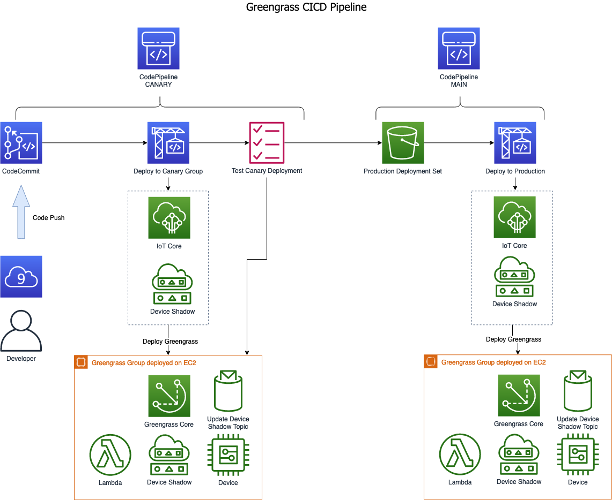

# CI/CD with AWS Greengrass
When provisioning application code to devices running **AWS Greengrass** there is two different events that trigger the provisioning of the code. The first trigger is the release of a new version of the application code, this triggers the CI/CD flow of build, test and deploy. The second trigger is when a new device has been produced. The factory flow usually has a workflow where the produced IoT box gets registered and paired with its host hardware (Vehicle, Machine or whatever appliance). Once the register and pairing flow is completed the latest version of the correct application is deployed.

In this workshop we explore both these two ways of triggering the deployment of a device running **AWS Greengrass**. 

## Prerequisites 

This workshop goes into how to do Continuous Deployment for **AWS Greengrass**. Basic knowledge and understanding of **AWS Greengrass** is required as well as **AWS CodePipeline** and **AWS CodeBuild**.

To get more information about these services you can find it by following these links:
* [AWS Greengrass](https://docs.aws.amazon.com/greengrass/latest/developerguide/what-is-gg.html)
* [AWS CodePipeline](https://docs.aws.amazon.com/codepipeline/latest/userguide/welcome.html)
* [AWS CodeBuild](https://docs.aws.amazon.com/codebuild/latest/userguide/welcome.html)

## The Workshop
The purpose of this workshop is to explore the two application deployment paths and how both can be done using **AWS CodePipeline** to deploy **AWS Greengrass**. To be able to focus on the application deployments a number of devices have been pre-provisioned in the workshop. The fleets of devices running **AWS Greengrass** in this workshop is a set of **AWS EC2** instances in the workshop account. These **AWS EC2** instances are self-provisioning and have a mocked register & pairing process implemented, as this process is not the scope of this workshop.

There are two pipelines setup by the workshop. The first one is connected to the source code repository and is responsible for the release of the code and deployment of a **Canary Fleet**. The **Canary Fleet** is used to verify that the application is work as expected before the change is pushed to the deployment of the **Main Fleet**. 



The built in registering and pairing process on the **AWS EC2** instances running **AWS Greengrass** ends with a control file being written to S3. This triggers the deployment of the newly produced device running **AWS Greengrass**. 


This workshop is based on the following blog post **Implementing a CI/CD pipeline for AWS IoT Greengrass projects** (follow this [Link](https://aws.amazon.com/blogs/iot/implementing-a-ci-cd-pipeline-for-aws-iot-greengrass-projects/) for details) but have modified it to use CDK and separated the test and production pipelines to allow for it to be used as part of the AWS Greengrass registration flow.

## Provision Greengrass devices
To provision the Greengrass devices run the following command in a terminal window:

```bash
make provision-greengrass
```

## Provision Pipelines
To provision the CI/CD Pipelines run the following command in a terminal window:

```bash
make provision-pipelines
```

## Setup workspace
As part of the provisioning of the Pipelines a CodeCommit repository was created. This step clones that repository and sets up the local workspaces with the workshop files.

```bash
make provision-workspace
```

Now let’s go ahead and push them into the git repository to trigger the pipeline to deploy to the Greengrass devices.

```bash
cd workspace/iot-gg-cicd-workshop-repo
source venv/bin/activate
git add .
git commit -a -m "added workshop source to repo"
git push -u origin master
```

## Cleanup
All the resource can be cleaned up by running the following commands in a terminal window:
#### Change to the top level directory of the workshop repo
Workspace deployed stacks
```bash
make destroy-deployments
```
Pipelines
```bash
make destroy-pipelines
```
Greengrass
```bash
make destroy-greengrass
```

## Security

See [CONTRIBUTING](CONTRIBUTING.md#security-issue-notifications) for more information.

## License

This library is licensed under the MIT-0 License. See the LICENSE file.